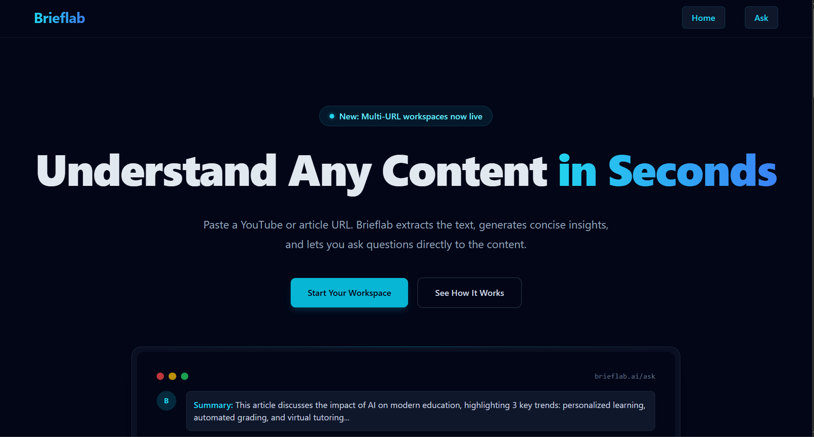
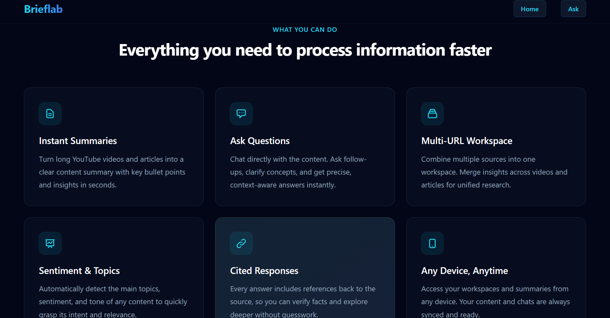
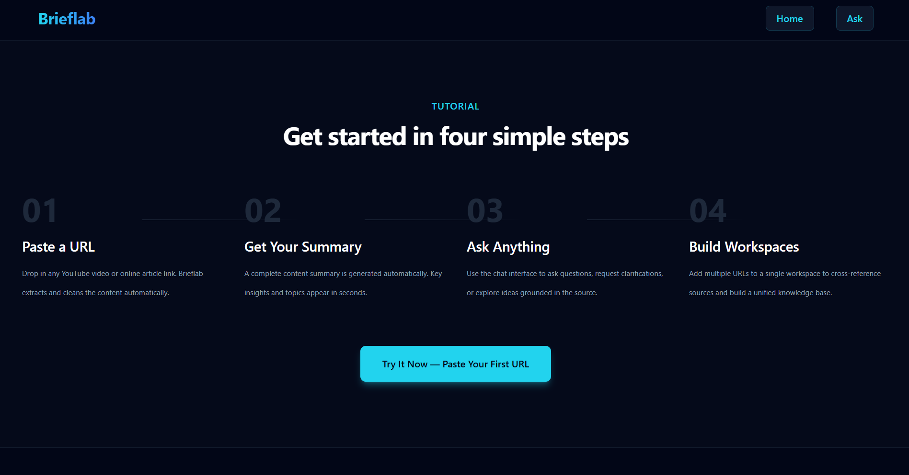
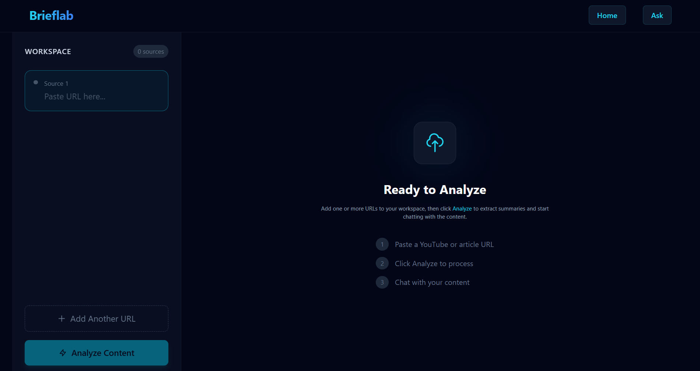
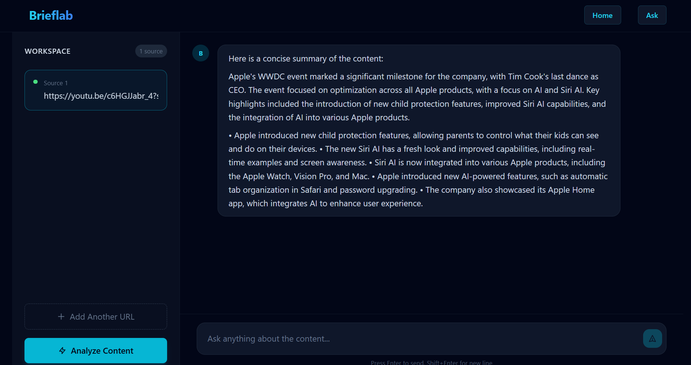

<div align="center">
  <h1>Brieflab</h1>
  <p><strong>Understand any content — YouTube or article — in seconds with AI-powered summaries and RAG-based Q&A.</strong></p>

  <p>
    
    
    
    
    
    
    
  </p>
</div>

---

## Description

Brieflab is a full-stack AI application that lets you paste a YouTube video or online article URL and instantly get a concise summary. Beyond summarization, you can ask follow-up questions directly to the content using a **Retrieval-Augmented Generation (RAG)** pipeline — no hallucinations, just grounded answers with source citations.

Built for researchers, students, and professionals who need to process large amounts of content quickly.

---

## Features

- **Instant Summaries** — Turn long videos and articles into clear bullet-point summaries in seconds.
- **Ask Questions** — Chat directly with the content. Get precise, context-aware answers with source citations.
- **Multi-URL Workspace** — Combine multiple sources into one workspace. Cross-reference insights across videos and articles.
- **Sentiment & Topic Detection** — Automatically detect main topics, sentiment, and tone of any content.
- **Cited Responses** — Every answer includes references back to the source for verification.
- **Any Device, Anytime** — Responsive design works on desktop, tablet, and mobile.

---

## Tech Stack

| Layer                  | Technology                                                                      |
| ---------------------- | ------------------------------------------------------------------------------- |
| **Frontend**           | React 19, Vite 8, Tailwind CSS 3, React Router 7                                |
| **Backend**            | FastAPI (Python), Uvicorn, Pydantic                                             |
| **AI / LLM**           | LangChain, Ollama (local LLM), HuggingFace Inference API (embeddings)           |
| **Vector Database**    | Qdrant                                                                          |
| **Content Extraction** | youtube-transcript-api, trafilatura                                             |
| **Markdown Rendering** | react-markdown, remark-gfm, remark-math, rehype-katex, react-syntax-highlighter |

---

## Architecture Overview

```
User's Browser (React 19 + Tailwind)
        │
        │ HTTP (localhost:8000)
        ▼
    FastAPI Backend
        │
        ├── /api/analyze  →  Extract content (youtube-transcript-api / trafilatura)
        │                  →  Chunk text
        │                  →  Generate embeddings (HuggingFace Inference API)
        │                  →  Store in Qdrant vector DB
        │                  →  Return summary (Ollama LLM)
        │
        └── /api/ask      →  Semantic search in Qdrant
                           →  Retrieve relevant chunks
                           →  Generate grounded answer (Ollama LLM)
                           →  Return answer + citations
```

The frontend communicates with the FastAPI backend via REST endpoints. The backend handles content extraction, text chunking, embedding generation, vector storage/retrieval in Qdrant, and LLM-based summarization/Q&A via LangChain.

---

## Screenshots

> **Tip:** Create a `screenshots/` folder in the project root and add your images here.

```md
screenshots/
├── home-1.png
├── home-2.png
├── home-3.png
├── workspace.png
├── chat.png
└── mobile.png
```

### Home Screen





### Workspace & Analysis



### Chat Interface



---

## Installation

### Prerequisites

- Node.js 18+
- Python 3.11+
- [Ollama](https://ollama.com/) installed locally with a model pulled (e.g., `llama3`)

### Clone the Repository

```bash
git clone https://github.com/yourusername/brieflab.git
cd brieflab
```

### Backend Setup

```bash
cd backend
python -m venv .venv
.venv\Scripts\activate    # Windows
# source .venv/bin/activate  # macOS/Linux

pip install -r requirements.txt
```

### Frontend Setup

```bash
cd client
npm install
```

---

## Environment Variables

Create a `.env` file in the `backend/` directory:

````env
# FastAPI
CORS_ORIGINS=["http://localhost:5173"]

# Qdrant — local or cloud
QDRANT_URL=http://localhost:6333
QDRANT_API_KEY=

# Ollama
OLLAMA_BASE_URL=http://localhost:11434
OLLAMA_MODEL=lama3.2:3b-instruct-q4_K_M

#Ollama Embedding
EMBEDDING_MODEL=bge-m3


## Running the Project

### 1. Start Qdrant

```bash
# Using Docker
docker run -p 6333:6333 qdrant/qdrant
````

### 2. Start Ollama

```bash
ollama pull llama3
ollama bge-m3
ollama serve
```

### 3. Start the Backend

```bash
cd backend
.venv\Scripts\activate
uvicorn main:app --reload --port 8000
```

The API will be available at `http://localhost:8000`. Visit `http://localhost:8000/docs` for the interactive Swagger docs.

### 4. Start the Frontend

```bash
cd client
npm run dev
```

The app will be available at `http://localhost:5173`.

---

## Folder Structure

```
brieflab/
│
├── backend/
│   ├── app/
│   │   ├── api/
│   │   │   └── routes.py          # FastAPI route handlers
│   │   ├── core/
│   │   │   ├── config.py          # Settings & env vars
│   │   │   ├── schemas.py         # Pydantic models
│   │   │   └── utils.py           # Helpers
│   │   └── services/
│   │       ├── chunker.py         # Text splitting
│   │       ├── embedder.py        # Embedding generation
│   │       ├── extractor.py       # URL content extraction
│   │       ├── llm.py             # LLM interactions
│   │       ├── pipeline.py        # Orchestration
│   │       └── qdrant_service.py  # Vector DB operations
│   ├── main.py                    # FastAPI app entry
│   ├── requirements.txt
│   ├── pyproject.toml
│   └── .env
│
├── client/
│   ├── src/
│   │   ├── Pages/
│   │   │   ├── Home.jsx           # Landing page
│   │   │   └── Ask.jsx            # Workspace & chat
│   │   ├── Components/
│   │   │   ├── Navbar.jsx
│   │   │   └── Footer.jsx
│   │   ├── App.jsx                # Router setup
│   │   ├── main.jsx               # Entry point
│   │   ├── index.css              # Tailwind imports
│   │   └── App.css
│   ├── package.json
│   ├── vite.config.js
│   ├── tailwind.config.js
│   ├── postcss.config.js
│   └── index.html
│
├── screenshots/                   # Add your screenshots here
├── README.md
└── .gitignore
```

---

## API Endpoints

| Method | Endpoint       | Description                                              |
| ------ | -------------- | -------------------------------------------------------- |
| `GET`  | `/health`      | Health check                                             |
| `POST` | `/api/analyze` | Submit URLs for extraction, summarization, and embedding |
| `POST` | `/api/ask`     | Ask a question about previously analyzed content         |

### POST /api/analyze

```json
// Request
{ "urls": ["https://youtube.com/watch?v=...", "https://example.com/article"] }

// Response
{ "sources": [{ "url": "...", "summary": "...", ... }] }
```

### POST /api/ask

```json
// Request
{ "urls": ["..."], "question": "What are the main points?" }

// Response
{ "answer": "...", "citations": [{ "text": "...", "highlight": true }] }
```

---

## Usage Guide

1. **Open the app** at `http://localhost:5173`
2. **Paste a URL** — YouTube video or article link — into the workspace sidebar
3. **Click Analyze** — Brieflab extracts, summarizes, and indexes the content
4. **Review the summary** — Key points and topics appear in the chat
5. **Ask questions** — Type any question about the content and get grounded answers
6. **Add more URLs** — Combine multiple sources in one workspace for cross-document research

---

## Deployment

### Frontend

```bash
cd client
npm run build
```

Deploy the `client/dist/` folder to any static host (Vercel, Netlify, Cloudflare Pages).

### Backend

```bash
cd backend
docker build -t brieflab-api .
```

Deploy as a container to any cloud provider (Railway, Fly.io, AWS ECS, etc.).

### Requirements

- Qdrant cloud instance or self-hosted
- Ollama server (or use OpenAI-compatible API)
- HuggingFace Inference API token (for embeddings)

---

## Future Improvements

- [ ] User authentication (OAuth / JWT)
- [ ] Persistent workspace sessions (save & resume)
- [ ] PDF document upload support
- [ ] Export summaries to PDF / Markdown
- [ ] Dark/light theme toggle
- [ ] History of past analyses
- [ ] i18n / multi-language support

---

## Contributing

Contributions are welcome! Here's how to get started:

1. Fork the repository
2. Create a feature branch (`git checkout -b feature/amazing-feature`)
3. Commit your changes (`git commit -m 'Add amazing feature'`)
4. Push to the branch (`git push origin feature/amazing-feature`)
5. Open a Pull Request

Please make sure your code follows the existing style conventions and passes linting.

---

## License

Distributed under the **MIT License**. See `LICENSE` for more information.

---

## Author

**Brieflab** — Built with ❤️

For questions, feedback, or collaboration, please open an issue on GitHub.

---

## Acknowledgements

- [LangChain](https://www.langchain.com/) — LLM orchestration framework
- [Qdrant](https://qdrant.tech/) — Vector database
- [Ollama](https://ollama.com/) — Local LLM runtime
- [FastAPI](https://fastapi.tiangolo.com/) — Backend framework
- [React](https://react.dev/) — Frontend library
- [Tailwind CSS](https://tailwindcss.com/) — Utility-first CSS framework
- [Vite](https://vitejs.dev/) — Build tool
